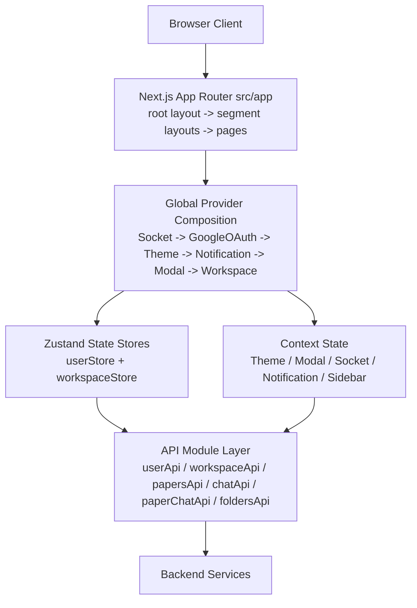
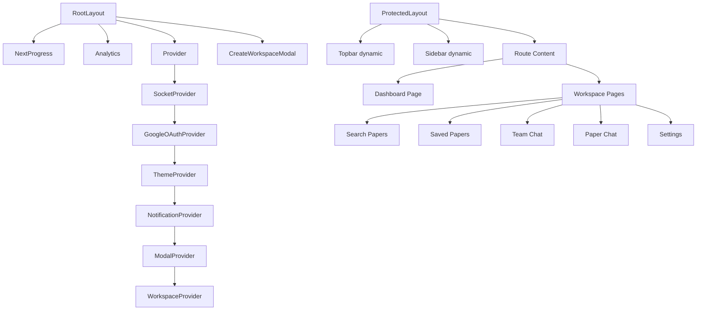
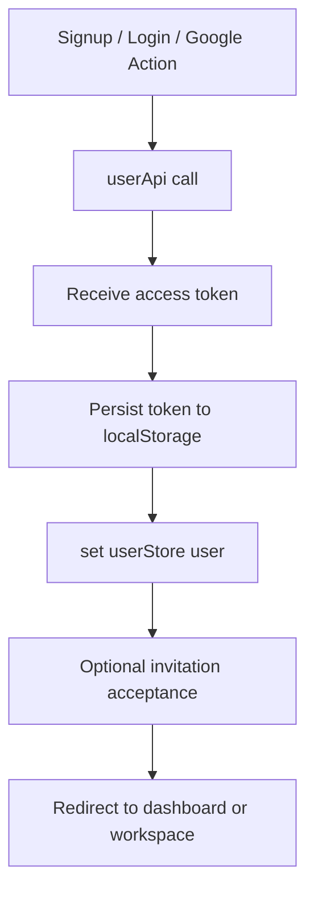
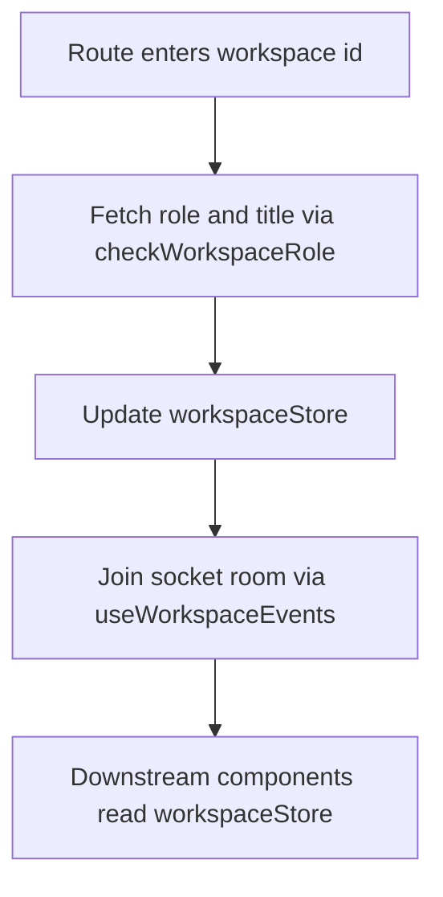
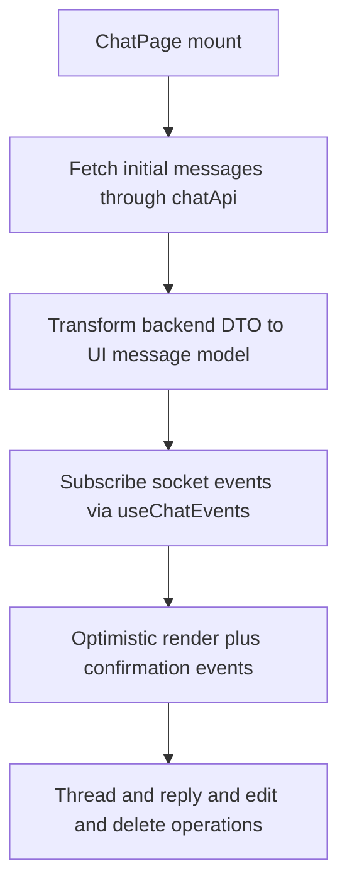
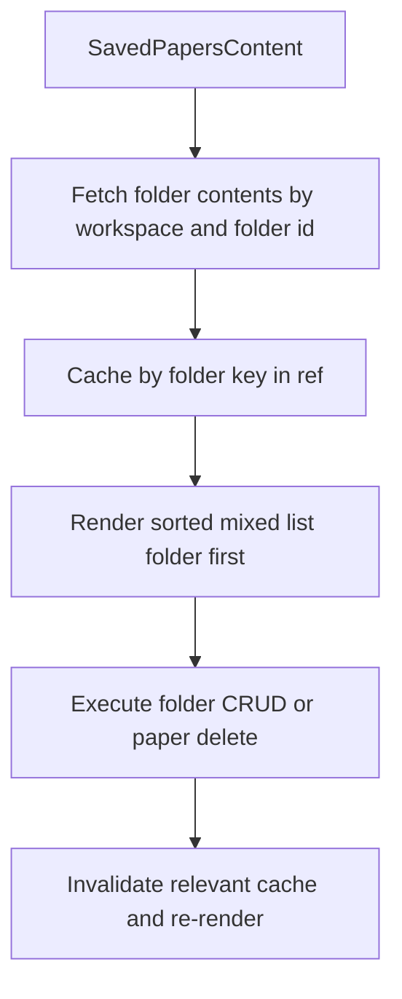
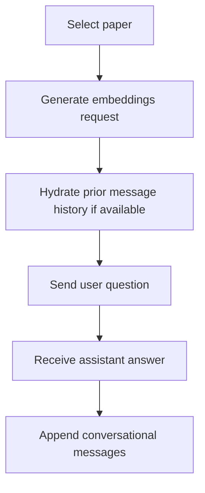

# Frontend Architecture

## START HERE

Read this file after [README.md](./README.md). For coding standards and non-negotiable implementation rules, read [AGENT_GUIDELINES.md](./AGENT_GUIDELINES.md).

IMPORTANT:

- Route segments in `src/app` are architectural boundaries, not only folders.
- Keep cross-cutting concerns in providers/hooks and feature concerns in module components.
- Preserve API abstraction layer in `src/api` and avoid direct axios usage in feature pages unless the pattern already exists.

## 1. System Shape



## 2. App Router Segmentation

| Segment       | Primary Responsibility          | Typical Components              |
| ------------- | ------------------------------- | ------------------------------- |
| `(public)`    | Auth, OTP, onboarding           | Login/Signup/VerifyOtp/Username |
| `(general)`   | Tokenized invitation acceptance | AcceptInvitation page           |
| `(protected)` | Dashboard + workspace app shell | Sidebar, Topbar, feature pages  |
| `api/logout`  | Server-side cookie cleanup      | Route handler                   |

### Why This Segmentation Matters

- It allows per-segment layouts for auth vs app-shell UX.
- It isolates protected screens from public screens.
- It simplifies edge protection in middleware/proxy matching.

## 3. Component Hierarchy



## 4. State Management Architecture

### 4.1 Store vs Context Decision Matrix

| Concern                            | Mechanism                          | Rationale                                    |
| ---------------------------------- | ---------------------------------- | -------------------------------------------- |
| User identity                      | Zustand (`userStore`) with persist | Needed across routes and browser refresh     |
| Active workspace metadata          | Zustand (`workspaceStore`)         | Shared by sidebar, pages, API actions        |
| Theme                              | Context (`ThemeContext`)           | Global UI concern + class toggling           |
| Socket connection                  | Context (`SocketContext`)          | Single connection source for websocket hooks |
| Toast notifications                | Context (`NotificationContext`)    | Cross-cutting user feedback                  |
| Modal visibility                   | Context (`ModalContext`)           | Lightweight UI orchestration                 |
| Sidebar/workspace switcher toggles | Context (`SidebarContext`)         | Layout concern                               |

### 4.2 State Shape (Practical)

```ts
// userStore
{
  user: { id, firstName, username, email } | null,
  setUser(user),
  clearUser(),
  isAuthenticated()
}

// workspaceStore
{
  currentWorkspaceId: string | null,
  isOwner: boolean | null,
  workspaceTitle: string | null,
  isSearching: boolean,
  setWorkspace(id, isOwner, title),
  clearWorkspace(),
  setIsSearching(flag)
}
```

## 5. Data Flow Patterns

### 5.1 Auth Flow



### 5.2 Workspace Activation Flow



### 5.3 Chat Flow



### 5.4 Saved Papers + Folders Flow



### 5.5 Paper Chat Flow



## 6. API Integration Architecture

### 6.1 Axios Client and Interceptors

- Base config sets JSON headers and credentials.
- Request interceptor attaches `Authorization: Bearer <token>` if present.
- Response interceptor retries once for most 401 errors by calling refresh endpoint.
- On refresh failure: clear token, call `/api/logout`, and redirect to login.

### 6.2 API Module Boundaries

| Module File               | Responsibility                                 |
| ------------------------- | ---------------------------------------------- |
| `src/api/userApi.ts`      | Auth, OTP, username checks/updates             |
| `src/api/workspaceApi.ts` | Workspace CRUD-like actions + invite lifecycle |
| `src/api/papersApi.ts`    | Paper search + save/delete helper calls        |
| `src/api/chatApi.ts`      | Message fetch/search + attachment upload       |
| `src/api/paperChatApi.ts` | Embeddings + AI question/session history       |
| `src/api/foldersApi.ts`   | Folder tree, path, CRUD, content listing       |

## 7. Routing and Access Control

### 7.1 Edge/Proxy Guard

The proxy logic checks `authCookie` and redirects:

- Unauthenticated access to protected routes -> login.
- Authenticated access to auth routes -> dashboard.

### 7.2 In-UI Safeguards

- Components still check workspace/user state before actions.
- Logout utility clears local store and server cookies.
- Invitation flow can survive login transition via storage helpers.

## 8. Styling and Theming Architecture

- Tailwind utility classes provide local styling decisions.
- CSS variables in `globals.css` form a tokenized design system.
- `.dark` class toggled by ThemeContext controls color system.
- Custom animation utility classes define consistent motion semantics.

## 9. Performance Architecture

| Strategy                   | Where Used                        | Outcome                                |
| -------------------------- | --------------------------------- | -------------------------------------- |
| Dynamic imports            | Protected layout heavy components | Lower initial JS for route transitions |
| `memo` wrappers            | Providers, top-level components   | Less unnecessary re-rendering          |
| Local cache maps           | Paper search and folder content   | Fewer repeated API calls               |
| Controlled event listeners | Chat typing and keyboard handlers | Predictable lifecycle behavior         |
| Blob URL cleanup           | Chat attachment previews          | Avoid memory leaks                     |

## 10. Error Handling Architecture

- API errors normalized with readable custom message when possible.
- NotificationContext provides non-blocking user feedback.
- Form-level errors are surfaced with react-hook-form + zod.
- Critical auth failures trigger deterministic logout redirect.

## 11. Accessibility Principles in Current Structure

- Form labels and focus states are explicit.
- Modal overlays and key interactions are mostly centralized.
- Color tokens ensure visible contrast in both themes.

Recommended next improvements:

1. Add richer keyboard focus management for complex modal/panel stacks.
2. Expand ARIA metadata in chat and dynamic result panels.
3. Add automated accessibility checks to CI.

## 12. Deployment and Runtime Considerations

- Production API URL is environment-driven.
- Local fallback defaults exist for development.
- Vercel analytics is enabled at root layout.
- Build output relies on Next.js app-router conventions.

## 13. Architectural Anti-Patterns to Avoid

- Direct API URL strings inside feature components.
- Duplicated auth redirect logic across many pages.
- Mixing workspace identity source between params and ad hoc globals.
- Creating extra websocket connections outside SocketProvider.
- New global state in Context when local state is sufficient.

## 14. Architecture Change Checklist

Before merging architecture-impacting changes:

- Update [API_REFERENCE.md](./API_REFERENCE.md) for request/response changes.
- Update module docs for any changed workflows.
- Update [COMPONENT_LIBRARY.md](./COMPONENT_LIBRARY.md) if reusable contracts change.
- Add migration notes in [DEVELOPMENT.md](./DEVELOPMENT.md).
- Add or update tests for changed state/data flow behavior.
