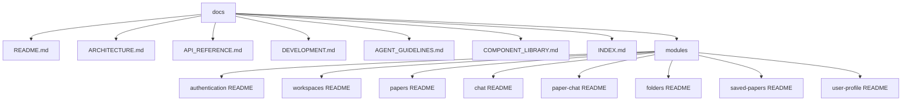

# Frontend Documentation Index

Complete navigation map for Research Zone Frontend documentation.

## START HERE

- AI/Coding Agent: [AGENT_GUIDELINES.md](./AGENT_GUIDELINES.md)
- New Developer: [README.md](./README.md) -> [DEVELOPMENT.md](./DEVELOPMENT.md)
- System Design: [ARCHITECTURE.md](./ARCHITECTURE.md)
- API Integration: [API_REFERENCE.md](./API_REFERENCE.md)
- Reusable UI: [COMPONENT_LIBRARY.md](./COMPONENT_LIBRARY.md)

IMPORTANT:

- Read module README docs before editing feature code.
- Keep API docs and module docs aligned with code behavior.

## 1. Documentation File List

| File                                           | Purpose                                                    | Audience                        |
| ---------------------------------------------- | ---------------------------------------------------------- | ------------------------------- |
| [README.md](./README.md)                       | Frontend overview, stack, route map, architecture snapshot | Everyone                        |
| [ARCHITECTURE.md](./ARCHITECTURE.md)           | Component/state/data-flow architecture                     | Senior devs, architects, agents |
| [API_REFERENCE.md](./API_REFERENCE.md)         | Endpoint usage and error handling matrix                   | Frontend engineers, integrators |
| [DEVELOPMENT.md](./DEVELOPMENT.md)             | Setup, debugging, testing, runbooks                        | Developers, QA                  |
| [AGENT_GUIDELINES.md](./AGENT_GUIDELINES.md)   | Mandatory coding standards and anti-patterns               | AI/Coding agents                |
| [COMPONENT_LIBRARY.md](./COMPONENT_LIBRARY.md) | Reusable component contracts and examples                  | Frontend devs, designers        |
| [INDEX.md](./INDEX.md)                         | Searchable navigation reference                            | Everyone                        |

## 2. Role-Based Quick Start

### Developer Quick Start

1. [README.md](./README.md)
2. [DEVELOPMENT.md](./DEVELOPMENT.md)
3. [ARCHITECTURE.md](./ARCHITECTURE.md)
4. Relevant module doc under [modules](./modules)
5. [API_REFERENCE.md](./API_REFERENCE.md)

### Designer / UX Engineer Quick Start

1. [COMPONENT_LIBRARY.md](./COMPONENT_LIBRARY.md)
2. [ARCHITECTURE.md](./ARCHITECTURE.md)
3. Feature module docs for target flow

### AI Agent Quick Start

1. [AGENT_GUIDELINES.md](./AGENT_GUIDELINES.md)
2. [ARCHITECTURE.md](./ARCHITECTURE.md)
3. [API_REFERENCE.md](./API_REFERENCE.md)
4. Target module README(s)
5. [DEVELOPMENT.md](./DEVELOPMENT.md)

## 3. Module Navigation

| Module         | File                                                                   | Key Topics                                          |
| -------------- | ---------------------------------------------------------------------- | --------------------------------------------------- |
| Authentication | [modules/authentication/README.md](./modules/authentication/README.md) | login/signup, OTP, Google auth, onboarding          |
| Workspaces     | [modules/workspaces/README.md](./modules/workspaces/README.md)         | workspace creation, switching, invites, roles       |
| Papers         | [modules/papers/README.md](./modules/papers/README.md)                 | search, metadata, save flow                         |
| Chat           | [modules/chat/README.md](./modules/chat/README.md)                     | real-time chat, threads, typing, search             |
| Paper-Chat     | [modules/paper-chat/README.md](./modules/paper-chat/README.md)         | paper selection, embeddings, AI Q&A                 |
| Folders        | [modules/folders/README.md](./modules/folders/README.md)               | folder tree, path, CRUD rules                       |
| Saved-Papers   | [modules/saved-papers/README.md](./modules/saved-papers/README.md)     | folderized saved papers, sorting, deletion          |
| User Profile   | [modules/user-profile/README.md](./modules/user-profile/README.md)     | settings, role view, logout, leave/delete workspace |

## 4. Search Guide (25+ Common Topics)

| Topic                        | Go To                                                                  |
| ---------------------------- | ---------------------------------------------------------------------- |
| App Router segment strategy  | [ARCHITECTURE.md](./ARCHITECTURE.md)                                   |
| Provider composition order   | [ARCHITECTURE.md](./ARCHITECTURE.md)                                   |
| Zustand state shape          | [ARCHITECTURE.md](./ARCHITECTURE.md)                                   |
| Axios interceptor behavior   | [API_REFERENCE.md](./API_REFERENCE.md)                                 |
| Token refresh flow           | [API_REFERENCE.md](./API_REFERENCE.md)                                 |
| Login form behavior          | [modules/authentication/README.md](./modules/authentication/README.md) |
| Signup conflicts (409)       | [modules/authentication/README.md](./modules/authentication/README.md) |
| OTP resend flow              | [modules/authentication/README.md](./modules/authentication/README.md) |
| Invitation acceptance flow   | [modules/workspaces/README.md](./modules/workspaces/README.md)         |
| Workspace role detection     | [modules/workspaces/README.md](./modules/workspaces/README.md)         |
| Workspace switcher tabs      | [modules/workspaces/README.md](./modules/workspaces/README.md)         |
| Paper search pagination      | [modules/papers/README.md](./modules/papers/README.md)                 |
| Save paper to folder         | [modules/papers/README.md](./modules/papers/README.md)                 |
| Folder CRUD endpoints        | [modules/folders/README.md](./modules/folders/README.md)               |
| Folder path breadcrumbs      | [modules/folders/README.md](./modules/folders/README.md)               |
| Saved papers sorting         | [modules/saved-papers/README.md](./modules/saved-papers/README.md)     |
| Delete paper behavior        | [modules/saved-papers/README.md](./modules/saved-papers/README.md)     |
| Chat message transform       | [modules/chat/README.md](./modules/chat/README.md)                     |
| Chat attachments upload      | [modules/chat/README.md](./modules/chat/README.md)                     |
| Thread reply interactions    | [modules/chat/README.md](./modules/chat/README.md)                     |
| Typing indicator lifecycle   | [modules/chat/README.md](./modules/chat/README.md)                     |
| Chat search panel            | [modules/chat/README.md](./modules/chat/README.md)                     |
| Paper embedding generation   | [modules/paper-chat/README.md](./modules/paper-chat/README.md)         |
| Paper chat prompts           | [modules/paper-chat/README.md](./modules/paper-chat/README.md)         |
| Theme token usage            | [COMPONENT_LIBRARY.md](./COMPONENT_LIBRARY.md)                         |
| Toast notification pattern   | [COMPONENT_LIBRARY.md](./COMPONENT_LIBRARY.md)                         |
| Agent coding standards       | [AGENT_GUIDELINES.md](./AGENT_GUIDELINES.md)                           |
| Common debug steps           | [DEVELOPMENT.md](./DEVELOPMENT.md)                                     |
| Deployment env configuration | [DEVELOPMENT.md](./DEVELOPMENT.md)                                     |
| Security checklist           | [AGENT_GUIDELINES.md](./AGENT_GUIDELINES.md)                           |

## 5. Component Library Reference

Primary reusable component references:

- Shell: [COMPONENT_LIBRARY.md](./COMPONENT_LIBRARY.md)
- Shared feedback: [COMPONENT_LIBRARY.md](./COMPONENT_LIBRARY.md)
- Feature containers: [COMPONENT_LIBRARY.md](./COMPONENT_LIBRARY.md)

## 6. File Structure Reference

## 7. Development Workflow Reference

### Add New Feature

1. Read target module README.
2. Follow patterns in [AGENT_GUIDELINES.md](./AGENT_GUIDELINES.md).
3. Implement using existing state/API abstractions.
4. Add loading/error/empty states.
5. Update module README and relevant root docs.

### Fix Bug

1. Reproduce issue and identify owning module.
2. Validate state + API + route interaction points.
3. Add regression checks or test notes.
4. Update [DEVELOPMENT.md](./DEVELOPMENT.md) issue table when useful.

### Refactor

1. Preserve external component/API contracts or document migration.
2. Update [COMPONENT_LIBRARY.md](./COMPONENT_LIBRARY.md) if shared contracts change.
3. Update architecture/data-flow docs if behavior changed.

## 8. Component Usage Checklist

Before using or adding a component:

- Confirm existing shared component does not already solve it.
- Keep props typed and explicit.
- Handle loading/error/empty states where relevant.
- Provide accessible labels and keyboard support.
- Keep API calls in module clients, not deep UI leaves.
- Add docs entry if component is reusable.

## 9. Where To Look By Problem Type

| Problem Type                      | First Document                                                 |
| --------------------------------- | -------------------------------------------------------------- |
| Broken auth redirect              | [DEVELOPMENT.md](./DEVELOPMENT.md)                             |
| Unexpected 401 and refresh issues | [API_REFERENCE.md](./API_REFERENCE.md)                         |
| Chat realtime not syncing         | [modules/chat/README.md](./modules/chat/README.md)             |
| Folder tree mismatch              | [modules/folders/README.md](./modules/folders/README.md)       |
| Save paper flow failing           | [modules/papers/README.md](./modules/papers/README.md)         |
| Invite accept issues              | [modules/workspaces/README.md](./modules/workspaces/README.md) |
| Theme inconsistencies             | [ARCHITECTURE.md](./ARCHITECTURE.md)                           |
| Reusable component decisions      | [COMPONENT_LIBRARY.md](./COMPONENT_LIBRARY.md)                 |

## 10. Documentation Maintenance Rules

- Keep tables and endpoint names exact.
- Prefer implementation-specific notes over generic advice.
- Update docs in same PR as behavior changes.
- Include migration notes for contract changes.
