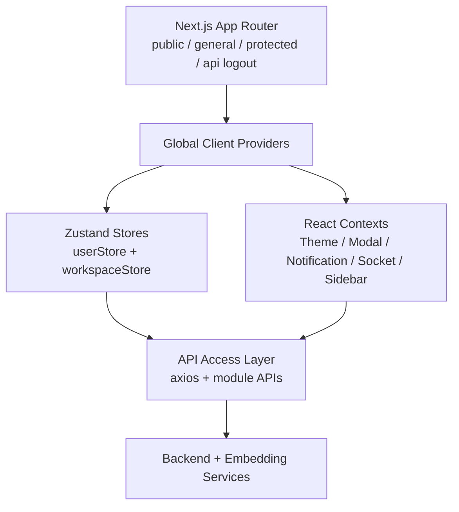
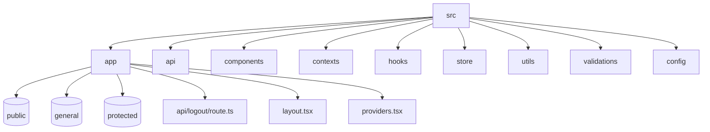
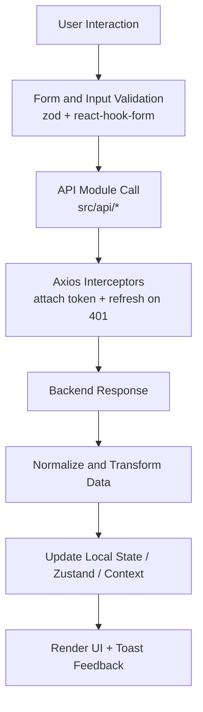

# Research Zone Frontend - Documentation

Welcome to the Research Zone Frontend documentation. This folder is the implementation map for the Next.js client application, including architecture, API usage, component patterns, and engineering standards for humans and coding agents.

## START HERE

For AI/Coding Agents: [AGENT_GUIDELINES.md](./AGENT_GUIDELINES.md) -> [INDEX.md](./INDEX.md) -> module docs.

For Frontend Developers: this file -> [DEVELOPMENT.md](./DEVELOPMENT.md) -> [ARCHITECTURE.md](./ARCHITECTURE.md).

IMPORTANT:

- Read [AGENT_GUIDELINES.md](./AGENT_GUIDELINES.md) before modifying shared components, hooks, stores, or API clients.
- Validate route segment intent before changing layout trees under `src/app`.
- Keep business behavior in feature modules, not in generic UI wrappers.

## Documentation Quick Navigation

### Mandatory Core Files

- [AGENT_GUIDELINES.md](./AGENT_GUIDELINES.md) - Standards for React component structure, hooks, state, API calls, testing, security, and review checklists.
- [INDEX.md](./INDEX.md) - Full navigation map with role-based entry points and topic search table.
- [ARCHITECTURE.md](./ARCHITECTURE.md) - Component hierarchy, route segmentation, state topology, and end-to-end data flow.
- [API_REFERENCE.md](./API_REFERENCE.md) - Frontend API usage matrix and request/response handling.
- [DEVELOPMENT.md](./DEVELOPMENT.md) - Setup, workflows, debugging, testing strategy, and production checks.
- [COMPONENT_LIBRARY.md](./COMPONENT_LIBRARY.md) - Reusable component catalog with examples and extension patterns.

### Feature Module Docs

- [modules/authentication/README.md](./modules/authentication/README.md)
- [modules/workspaces/README.md](./modules/workspaces/README.md)
- [modules/papers/README.md](./modules/papers/README.md)
- [modules/chat/README.md](./modules/chat/README.md)
- [modules/paper-chat/README.md](./modules/paper-chat/README.md)
- [modules/folders/README.md](./modules/folders/README.md)
- [modules/saved-papers/README.md](./modules/saved-papers/README.md)
- [modules/user-profile/README.md](./modules/user-profile/README.md)

## Project Overview

Research Zone Frontend is a Next.js App Router client for collaborative research workflows. It supports:

- Email + Google authentication.
- OTP-based account verification.
- Workspace-centric navigation and permissions.
- Research paper search and save flow.
- Folderized saved-paper organization.
- Real-time workspace chat over Socket.IO.
- Paper-focused AI Q&A experience.
- Light/dark/system theming.

## Application Architecture Snapshot



## Tech Stack

| Area      | Library / Framework                         | Purpose                                          |
| --------- | ------------------------------------------- | ------------------------------------------------ |
| Runtime   | Next.js 16 + React 19 + TypeScript          | App Router UI framework                          |
| Styling   | Tailwind CSS 4 + CSS variables              | Utility styling + theme tokens                   |
| Forms     | react-hook-form + zod + @hookform/resolvers | Declarative form state + validation              |
| HTTP      | axios                                       | API calls and auth interceptors                  |
| State     | Zustand + React Context                     | Persistent user/session state + UI orchestration |
| Realtime  | socket.io-client                            | Live chat and workspace events                   |
| Motion    | framer-motion                               | Interaction and transition animations            |
| Icons     | lucide-react + react-icons                  | Iconography system                               |
| Analytics | @vercel/analytics                           | Product usage telemetry                          |

## Directory Structure



## Core Architectural Principles

1. Thin page components, behavior-rich feature components.
2. Route-segmented layout boundaries for protected/public logic.
3. Centralized API access through typed module clients.
4. Keep transient UI state local; persist identity/workspace state in Zustand.
5. Use Context for cross-cutting concerns (theme, notifications, sockets, modal flags).
6. Favor composition and hooks over inheritance and utility singletons.
7. Fail visibly and safely with user-facing notifications.

## High-Level Feature Domains

| Domain                 | What It Covers                                                 | Primary Paths                                                                                    |
| ---------------------- | -------------------------------------------------------------- | ------------------------------------------------------------------------------------------------ |
| Authentication         | Signup, login, Google auth, OTP, onboarding username           | `src/components/auth`, `src/components/onboarding`, `src/api/userApi.ts`                         |
| Workspace Management   | Workspace creation, invitation, role detection, switching      | `src/components/layout/sidebar`, `src/components/dashboard/workspace`, `src/api/workspaceApi.ts` |
| Papers                 | Search, metadata rendering, save to folders                    | `src/components/dashboard/papersLibrary.tsx`, `src/api/papersApi.ts`                             |
| Folders + Saved Papers | Folder CRUD, breadcrumbs, sorting, paper removal               | `src/components/saved-papers`, `src/api/foldersApi.ts`                                           |
| Team Chat              | Message thread UI, typing indicators, attachment upload/search | `src/components/chat`, `src/hooks/websocket`, `src/api/chatApi.ts`                               |
| Paper Chat             | Embedding prep + AI question flow for selected papers          | `src/components/paper-chat`, `src/api/paperChatApi.ts`                                           |
| Profile + Settings     | Workspace role display, leave/delete actions, logout behavior  | `src/app/(protected)/workspace/[id]/settings/page.tsx`                                           |

## Route Surface

```mermaid
flowchart LR
	subgraph Public
		P1[/ /]
		P2[/auth/login/]
		P3[/auth/signup/]
		P4[/auth/verifyotp/]
		P5[/onboarding/username/]
		P6[/onboarding/picture/]
	end

	subgraph General
		G1[/accept-invitation/[token]/]
	end

	subgraph Protected
		R1[/dashboard/]
		R2[/workspace/[id]/]
		R3[/workspace/[id]/search-papers/]
		R4[/workspace/[id]/saved-papers/]
		R5[/workspace/[id]/chat/]
		R6[/workspace/[id]/paper-chat/]
		R7[/workspace/[id]/settings/]
	end
```

## Frontend Data Flow (End-to-End)



## Security and Reliability Highlights

- Access token is client-side and attached by request interceptor.
- Refresh token is cookie-based; interceptor retries once on 401.
- Logout route clears auth and CloudFront cookies server-side.
- Route protection is enforced via proxy middleware and in-app redirects.
- Invitation token flow persists short-lived state for post-login acceptance.

## Reading Paths by Role

### Frontend Engineer

1. [DEVELOPMENT.md](./DEVELOPMENT.md)
2. [ARCHITECTURE.md](./ARCHITECTURE.md)
3. [API_REFERENCE.md](./API_REFERENCE.md)
4. Relevant module README
5. [COMPONENT_LIBRARY.md](./COMPONENT_LIBRARY.md)

### Product Designer / UX Engineer

1. [COMPONENT_LIBRARY.md](./COMPONENT_LIBRARY.md)
2. [ARCHITECTURE.md](./ARCHITECTURE.md)
3. Module docs for target flow

### Coding Agent

1. [AGENT_GUIDELINES.md](./AGENT_GUIDELINES.md)
2. [INDEX.md](./INDEX.md)
3. [ARCHITECTURE.md](./ARCHITECTURE.md)
4. [API_REFERENCE.md](./API_REFERENCE.md)
5. Relevant module README(s)
6. [DEVELOPMENT.md](./DEVELOPMENT.md)

## Definitions

| Term            | Meaning                                                       |
| --------------- | ------------------------------------------------------------- |
| Workspace       | Collaboration container for users, chat, papers, folders      |
| Saved Paper     | Paper entity stored in workspace context with optional folder |
| Paper Chat      | AI Q&A session focused on selected paper                      |
| Thread Reply    | Chat message associated with parent message                   |
| Invitation Flow | Token verification + auth + membership acceptance path        |

## Contribution Checklist

- Keep docs and behavior synchronized.
- Update module README when changing user-facing feature behavior.
- Update API reference when adding/changing request shapes.
- Update component library when adding reusable UI primitives.
- Add issue/fix notes in [DEVELOPMENT.md](./DEVELOPMENT.md) when incidents are resolved.
