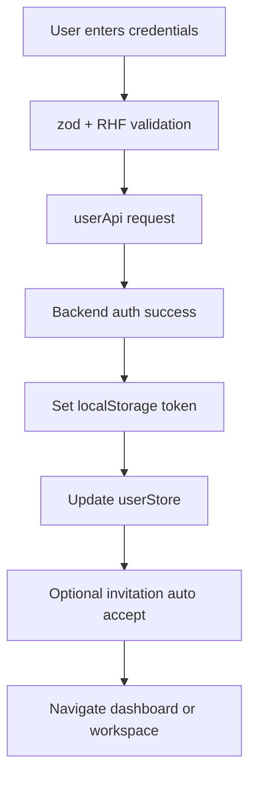
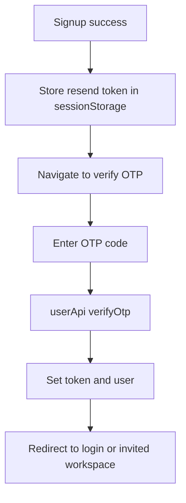

# Authentication Module

## START HERE

Use this guide when changing login, signup, OTP verification, Google auth, or onboarding identity flows.

IMPORTANT:

- Preserve invitation-aware auth behavior.
- Keep token lifecycle consistent with axios refresh logic.
- Validate UX states for loading, field errors, and auth failures.

## 1. Business Logic

Authentication enables users to:

- Create accounts with email/password.
- Verify account with OTP.
- Sign in with email/username + password.
- Sign in via Google OAuth code flow.
- Complete onboarding username setup.
- Continue pending invitation acceptance after auth.

## 2. UI Components

| Component                 | Responsibility                           | Key Inputs                                 |
| ------------------------- | ---------------------------------------- | ------------------------------------------ |
| `login.tsx`               | Credential + Google login                | identifier/password, OAuth code            |
| `signup.tsx`              | User registration form                   | first/last name, username, email, password |
| `verifyotp.tsx`           | 6-digit OTP verification and resend      | OTP digits, resend token                   |
| `onboarding/Username.tsx` | Debounced username availability + submit | username                                   |

### Props and Contract Patterns

Most auth components are page-level and do not expose props externally. They rely on:

- `userApi` for backend communication.
- `useUserStore` for user identity persistence.
- `useRouter` for route transitions.

## 3. State Management

### Local State

- Form-level loading and server error text.
- OTP digits and resend status flags.
- Username availability and debounce status.

### Global State

- `useUserStore.setUser(user)` after successful login/OTP verification.
- Local storage `accessToken` set on successful auth response.

### State Shape (Identity)

```ts
{
  id: string;
  firstName: string;
  username: string;
  email: string;
}
```

## 4. Data Flow



OTP flow:



## 5. API Integration

| Action         | API Method                                    |
| -------------- | --------------------------------------------- | ---------------------- |
| Signup         | `userApi.signup(data)`                        |
| Login          | `userApi.login({ email                        | username, password })` |
| Google Login   | `userApi.googleLogin(code)`                   |
| Verify OTP     | `userApi.verifyOtp(otp)`                      |
| Resend OTP     | `userApi.resendOtp(token)`                    |
| Username check | `userApi.checkUsernameAvailability(username)` |
| Add username   | `userApi.addUsername(username)`               |

### Loading/Error States

- Button disabled while request is in-flight.
- Backend 409 errors mapped to specific fields during signup.
- 401/403 login errors shown as contextual alerts.
- OTP failures clear input and focus first slot.

## 6. User Workflows

### 6.1 Email Signup + OTP Verify

1. User opens `/auth/signup`.
2. Completes form and submits.
3. Client calls signup endpoint.
4. On success, app stores resend token and redirects to OTP page.
5. User enters six-digit OTP.
6. App verifies OTP and stores access token.
7. User is redirected to login or invitation destination.

### 6.2 Login + Invitation Continuation

1. User opens invitation link (`/accept-invitation/[token]`).
2. Token verified and stored in invitation storage helpers.
3. If unauthenticated, user redirected to login.
4. On successful login, app reads invitation token + workspace ID.
5. App calls accept-invitation endpoint.
6. User redirected directly to invited workspace.

### 6.3 Google OAuth Login

1. User clicks Google button.
2. Receives auth code from OAuth flow.
3. Calls `google-login` endpoint.
4. If `newUser`, route to onboarding username.
5. Otherwise route to dashboard or invitation workspace.

## 7. Common Issues and Solutions

| Issue                                       | Root Cause                                  | Fix                                                    |
| ------------------------------------------- | ------------------------------------------- | ------------------------------------------------------ |
| Login succeeds but dashboard loops to login | Missing authCookie/backend session mismatch | Validate backend cookie settings and proxy rules       |
| OTP verification fails repeatedly           | Expired OTP or stale resend token           | Re-signup or request resend and verify token freshness |
| Invitation not accepted after login         | invitationStorage values missing            | Verify token/workspace persistence and clear timing    |
| Username check never resolves               | debounce or API error path swallowed        | Ensure loading/error state updates in catch/finally    |
| Google login blank failure                  | Missing client ID or OAuth config mismatch  | Verify env and console OAuth errors                    |

## 8. Component Example

```tsx
const onSubmit = async (data: LoginFormData) => {
  setApiError(null);
  try {
    const payload = data.identifier.includes("@")
      ? { email: data.identifier, password: data.password }
      : { username: data.identifier, password: data.password };

    const res = await userApi.login(payload);
    localStorage.setItem("accessToken", res.data.data.accessToken);
    setUser(res.data.data.user);
    router.push("/dashboard");
  } catch {
    setApiError("Login failed");
  }
};
```

## 9. Integration Points

- Workspace module: invitation acceptance post-auth.
- Route protection/proxy: authCookie redirects.
- User profile module: logout clears user store and cookies.
- Development docs: auth debugging and environment setup.

## 10. Extension Guidelines

When adding auth features:

1. Keep API calls in `src/api/userApi.ts`.
2. Add validation schema in `src/validations/validations.ts`.
3. Add UX state for loading, error, and success.
4. Update [API_REFERENCE.md](../../API_REFERENCE.md) and this file.
