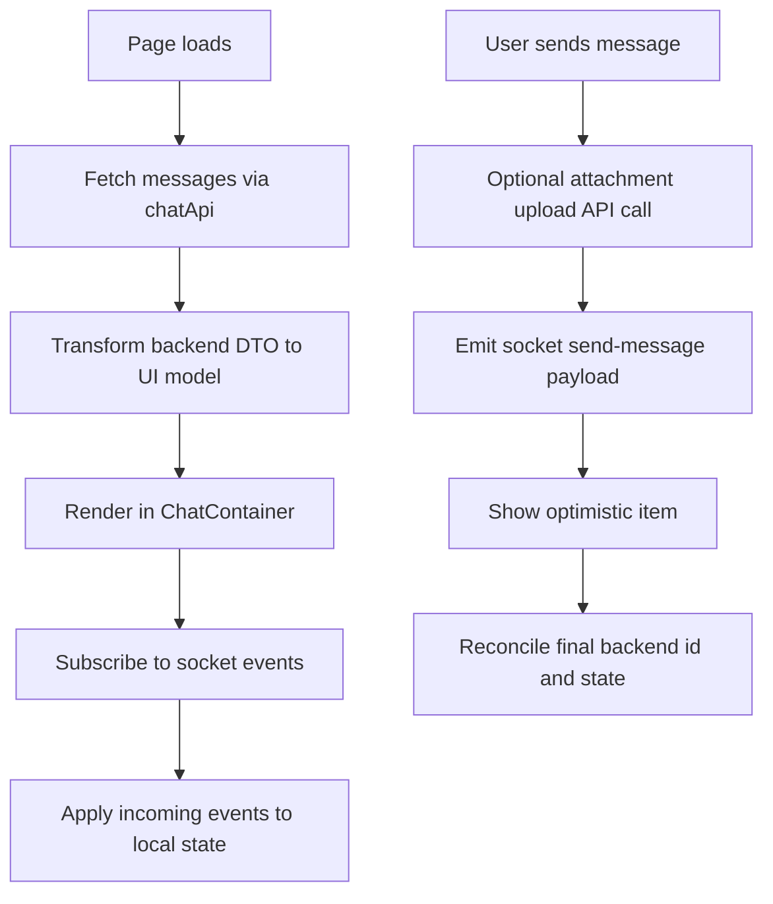

# Chat Module

## START HERE

This module powers real-time workspace chat including message history, message actions, thread replies, typing indicators, uploads, and search.

IMPORTANT:

- Keep REST history and socket events consistent.
- Never leak socket listeners; always unsubscribe on cleanup.
- Preserve optimistic UX while ensuring backend-confirmed identity reconciliation.

## 1. Business Logic

Users in a workspace can:

- View paginated message history.
- Send text and attachment messages.
- Edit and delete messages.
- Reply in threads and quote messages.
- Search message history.
- See typing indicators in real-time.

## 2. UI Components

| Component                      | Responsibility                                      |
| ------------------------------ | --------------------------------------------------- |
| `workspace/[id]/chat/page.tsx` | Feature orchestration and state ownership           |
| `ChatContainer`                | Main chat viewport, input, thread panel integration |
| `ChatMessage`                  | Individual message rendering + actions              |
| `MessageInput`                 | Composer, edit mode, attachments                    |
| `ThreadPanel`                  | Thread message/reply experience                     |
| `SearchChat`                   | Search entry and query trigger                      |
| `SearchResultsPanel`           | Search result display and message jump              |
| `DeleteConfirmModal`           | Delete confirmation UX                              |

## 3. State Management

### Local Feature State (ChatPage)

- `messages`
- `threadReplies`
- `cursor`, `hasMore`, `isLoadingMore`
- search states (`searchQuery`, `searchResults`, `showSearchResults`)
- upload and delete modal states

### Global Dependencies

- `userStore` for sender identity.
- `workspaceStore` for workspace id/title/search toggle.
- `SocketContext` for active socket client.
- `NotificationContext` for feedback.

## 4. Data Flow



## 5. API Integration

| Action             | Endpoint                                    |
| ------------------ | ------------------------------------------- |
| Fetch messages     | `GET /chat/workspace/:workspaceId/messages` |
| Upload attachments | `POST /chat/workspace/:workspaceId/upload`  |
| Search messages    | `POST /chat/workspace/:workspaceId/search`  |

## 6. Socket Event Integration

Common events consumed:

- `new-message`
- `message-sent`
- `message-deleted`
- `message-deletion-completed`
- `user_typing`
- `user_stop_typing`

Outbound emits:

- `send-message`
- `delete-message`
- `edit-message`
- `typing`
- `stop_typing`

## 7. User Workflows

### 7.1 Send Message

1. User types in message input.
2. Typing event emits with debounce.
3. User submits message.
4. Socket emits payload with optional attachments/reply refs.
5. Message appears in timeline and receives confirmation.

### 7.2 Thread Reply

1. User opens thread from a parent message.
2. Writes reply in thread panel.
3. Sends reply with parent id context.
4. Thread count and reply list update.

### 7.3 Search Messages

1. User triggers search panel.
2. Query sent to backend search endpoint.
3. Results displayed in side panel.
4. Click result to scroll and highlight message.

## 8. Common Issues and Solutions

| Issue                                   | Cause                              | Fix                                                             |
| --------------------------------------- | ---------------------------------- | --------------------------------------------------------------- |
| Duplicate incoming messages             | double event listeners             | verify effect cleanup and dependency stability                  |
| Typing indicator stuck                  | stop event not emitted/processed   | ensure timeout cleanup and latest message kill-switch           |
| Search result click cannot find message | message not loaded in current list | prompt to load more and support fetch-around cursor in future   |
| Attachment upload fails silently        | invalid response shape handling    | validate `attachments` array existence and throw explicit error |
| Memory growth over time                 | unreleased blob URLs               | track and revoke URL objects on unmount                         |

## 9. Component Example

```tsx
const { sendMessage, handleTyping, stopTyping } = useChatEvents({
  socket,
  workspaceId,
  onMessageReceived: appendMessage,
  onMessageDeleted: removeMessage,
});

<MessageInput
  onSend={(content, files) => onSendMessage(content, files)}
  onTyping={handleTyping}
  onStopTyping={stopTyping}
/>;
```

## 10. Integration Points

- Workspace module: room join and workspace-scoped message channels.
- User module: current user identity for own-message actions.
- Notification module: error toasts.
- API reference: message DTO contracts and upload responses.

## 11. Extension Guidelines

When adding chat capabilities:

1. Add typed payload/event contracts first.
2. Keep socket event handling in hooks.
3. Keep rendering components mostly pure.
4. Add loading and failure states for all network interactions.
5. Update docs for new events and endpoint dependencies.
