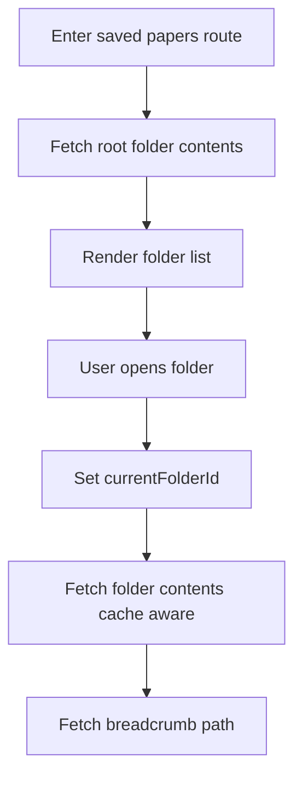
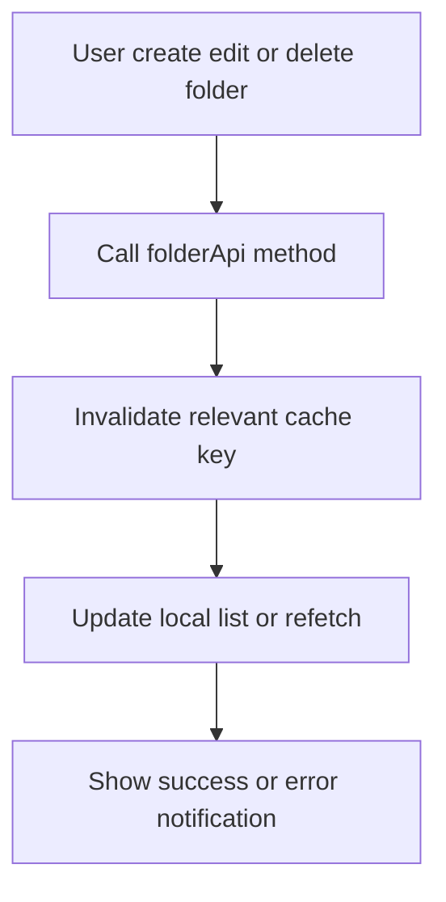

# Folders Module

## START HERE

This module documents folder hierarchy and folder CRUD capabilities used to organize saved papers in workspace scope.

IMPORTANT:

- Folder operations are workspace-scoped and must preserve hierarchy integrity.
- Recursive delete is destructive; maintain confirmation UX.
- Breadcrumb path retrieval is required for navigational clarity.

## 1. Business Logic

Folders provide hierarchical organization for saved papers:

- Create nested folders.
- Rename folders.
- Delete folders recursively.
- Browse folder contents.
- Display breadcrumb path for current location.

## 2. UI Components

Primary folder behavior is implemented in Saved Papers feature components:

| Component                   | Responsibility                                  |
| --------------------------- | ----------------------------------------------- |
| `SavedPapersContent`        | orchestrates folder navigation and CRUD actions |
| `FolderBreadcrumb`          | displays navigation trail                       |
| `FolderModal`               | create/edit folder form                         |
| `DeleteFolderModal`         | delete confirmation                             |
| `FolderList` + `FolderItem` | render folder nodes in list/grid                |

## 3. State Management

### Local State Patterns

- `currentFolderId`: current navigation node.
- `breadcrumbs`: path items from root to current.
- `cacheRef`: map of folderId -> folder contents.
- modal open flags + selected folder.

### Data Types

```ts
interface Folder {
  _id: string;
  name: string;
  workspaceId: string;
  parentFolderId: string | null;
  createdAt: string;
  updatedAt: string;
  itemType: "folder";
}
```

## 4. Data Flow



Folder mutation flow:



## 5. API Integration

| Action                    | Endpoint                                        |
| ------------------------- | ----------------------------------------------- |
| List folder contents      | `GET /folders/workspace/:workspaceId?folderId=` |
| Create folder             | `POST /folders`                                 |
| Update folder             | `PATCH /folders/:folderId`                      |
| Delete folder recursively | `DELETE /folders/:folderId/recursive`           |
| Get path                  | `GET /folders/:folderId/path`                   |
| Get tree                  | `GET /folders/workspace/:workspaceId/tree`      |

## 6. User Workflows

### 6.1 Create Folder

1. Open create folder modal.
2. Enter folder name.
3. Submit request.
4. Folder appears in current view.

### 6.2 Rename Folder

1. Trigger edit action on folder item.
2. Update name in modal.
3. Submit and update item in place.

### 6.3 Delete Folder

1. Trigger delete on folder item.
2. Confirm recursive delete warning.
3. Submit deletion.
4. Remove folder from current list.

### 6.4 Navigate Folders

1. Click folder to enter.
2. Breadcrumb updates using path API.
3. Click breadcrumb segment to move upward.

## 7. Common Issues and Solutions

| Issue                          | Cause                    | Fix                                             |
| ------------------------------ | ------------------------ | ----------------------------------------------- |
| Breadcrumb path missing        | path endpoint failure    | keep fallback to root and log error             |
| Deleted folder still visible   | stale cache entry        | invalidate current folder cache key             |
| Parent/child mismatch          | incorrect parent id sent | ensure `parentFolderId` omitted when null       |
| Slow navigation on large trees | repetitive fetches       | retain cache and invalidate only affected nodes |

## 8. Component Example

```ts
const handleCreateFolder = async (name: string) => {
  setIsSubmitting(true);
  try {
    const folder = await folderApi.createFolder(
      workspaceId,
      name,
      currentFolderId,
    );
    invalidateCache(currentFolderId);
    setItems((prev) => [folder, ...prev]);
    showSuccess(`Folder "${name}" created successfully`);
  } catch {
    showError("Failed to create folder");
  } finally {
    setIsSubmitting(false);
  }
};
```

## 9. Integration Points

- Saved Papers module consumes folders for organization.
- Papers module uses folder tree in save modal.
- Workspace module scopes folder operations by workspace id.

## 10. Extension Guidelines

If adding folder features:

1. Keep endpoint wrappers in `foldersApi.ts`.
2. Preserve recursive delete safety confirmation.
3. Add optimistic updates carefully with rollback path.
4. Document hierarchy constraints and limits.
