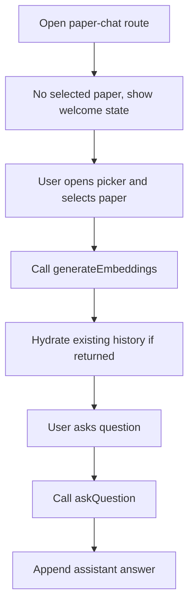

# Paper-Chat Module

## START HERE

This module enables conversational AI interaction with selected papers inside a workspace.

IMPORTANT:

- Embedding generation must complete before question answering.
- Selected paper context is required for all ask interactions.
- Preserve graceful fallback when AI or embedding services fail.

## 1. Business Logic

Users can:

- Open paper-chat view for a workspace.
- Select paper from workspace catalog.
- Trigger paper embedding preparation.
- Ask questions and receive assistant answers.
- Review session message timeline.

## 2. UI Components

| Component                            | Responsibility                                         |
| ------------------------------------ | ------------------------------------------------------ |
| `workspace/[id]/paper-chat/page.tsx` | Pass workspace context to container                    |
| `PaperChatContainer`                 | Main orchestrator for paper selection and message flow |
| `PaperPicker`                        | Select target paper                                    |
| `WelcomeView`                        | Empty state and onboarding guidance                    |
| `PaperContextBar`                    | Current paper summary and controls                     |
| `ChatMessages`                       | Message list rendering                                 |
| `ChatInput`                          | Prompt submission                                      |
| `SuggestedPrompts`                   | Starter prompts before conversation begins             |

## 3. State Management

### Local State in `PaperChatContainer`

- `selectedPaper`
- `isPickerOpen`
- `messages`
- `sessionId`
- `isWaitingResponse`
- `isGeneratingEmbeddings`

### Global Context Dependencies

- Notification context for errors.
- Workspace id passed from route.

## 4. Data Flow



## 5. API Integration

| Action                    | Endpoint                                        |
| ------------------------- | ----------------------------------------------- |
| Generate embeddings       | `POST /paper-chat/embeddings`                   |
| Ask question              | `POST /paper-chat/question`                     |
| Get/create session        | `GET /paper-chat/session/:workspaceId/:paperId` |
| Send message with session | `POST /paper-chat/message`                      |
| Get history               | `GET /paper-chat/history/:sessionId`            |
| Delete session            | `DELETE /paper-chat/session/:sessionId`         |
| List sessions             | `GET /paper-chat/sessions/:workspaceId`         |

Current UI primarily uses `generateEmbeddings` and `askQuestion`.

## 6. User Workflows

### 6.1 Select Paper and Start Chat

1. Open paper-chat page.
2. Click select paper action.
3. Choose paper in picker.
4. Wait for embedding preparation.
5. View paper context bar and suggested prompts.

### 6.2 Ask Question

1. Enter question in chat input.
2. User message appended immediately.
3. Waiting indicator shown.
4. Backend returns answer.
5. Assistant message appended.

## 7. Common Issues and Solutions

| Issue                     | Cause                             | Fix                                       |
| ------------------------- | --------------------------------- | ----------------------------------------- |
| Stuck in generating state | embedding API error not surfaced  | ensure finally block resets loading state |
| Empty assistant response  | missing answer key in response    | fallback to safe default text             |
| Wrong paper context       | selected paper stale after switch | reset messages/session on paper change    |
| Frequent API errors       | backend model/service unavailable | show retryable error and preserve input   |

## 8. Component Example

```tsx
const handleSendMessage = async (content: string) => {
  if (!selectedPaper) return;

  setMessages((prev) => [
    ...prev,
    {
      id: `user-${Date.now()}`,
      role: "user",
      content,
      timestamp: new Date(),
    },
  ]);

  setIsWaitingResponse(true);
  try {
    const data = await paperChatApi.askQuestion(selectedPaper._id, content);
    setMessages((prev) => [
      ...prev,
      {
        id: `ai-${Date.now()}`,
        role: "assistant",
        content: data?.answer || "No answer provided.",
        timestamp: new Date(),
      },
    ]);
  } finally {
    setIsWaitingResponse(false);
  }
};
```

## 9. Integration Points

- Saved Papers/Papers modules: provide paper entities for selection.
- Workspace module: workspace id scopes session access.
- Notification module: communicates AI/embedding failure states.

## 10. Extension Guidelines

For advanced paper-chat features:

1. Introduce persistent session management in UI state.
2. Add model/source attribution in assistant messages.
3. Add citation jump links to source paper sections.
4. Document new fields in [API_REFERENCE.md](../../API_REFERENCE.md).
