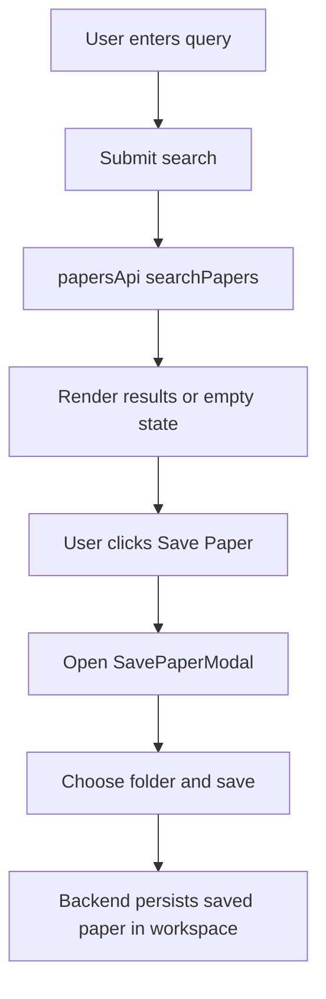

# Papers Module

## START HERE

This module covers research paper discovery, metadata display, pagination, and save-to-workspace flows.

IMPORTANT:

- Paper search results are user-discovery data, not workspace-bound until saved.
- Save operation requires active workspace context.
- Keep pagination and caching behavior predictable for user navigation.

## 1. Business Logic

Users can:

- Search research papers by query.
- Browse paginated results with metadata.
- Open external links and PDFs.
- Save selected paper into workspace folder structure.

## 2. UI Components

| Component                | Responsibility                                         |
| ------------------------ | ------------------------------------------------------ |
| `papersLibrary.tsx`      | Search form, result rendering, pagination, save action |
| `SavePaperModal.tsx`     | Select folder and submit save request                  |
| `search-papers/page.tsx` | Route shell for papers library                         |

## 3. State Management

### Local State (PaperLibrary)

- `searchQuery`
- `isLoading`
- `results`
- `hasSearched`
- `currentPage`
- `cache` keyed by `${query}-${page}`
- save-modal open state and selected paper

### Cross-Feature State

- uses `workspaceStore.currentWorkspaceId` for save action target.

## 4. Data Flow



## 5. API Integration

| Action                           | Endpoint                                   |
| -------------------------------- | ------------------------------------------ |
| Search papers                    | `GET /papers/search?q={query}&page={n}`    |
| Save paper                       | `POST /saved-papers`                       |
| Get folder tree for save context | `GET /folders/workspace/:workspaceId/tree` |

### Example Search Call

```ts
const data = await searchPapers(searchQuery, page);
setResults(data.results || []);
```

### Save Request Shape

```json
{
  "workspaceId": "ws_1",
  "folderId": "folder_1",
  "title": "Paper title",
  "link": "https://arxiv.org/abs/...",
  "authors": "Author A, Author B",
  "published": "2025-01-01"
}
```

## 6. User Workflows

### 6.1 Search and Browse

1. Open `/workspace/[id]/search-papers`.
2. Enter keywords and submit.
3. View list of matching papers.
4. Navigate pages with previous/next/page-number controls.

### 6.2 Save Paper

1. From result card, click Save Paper.
2. Choose folder/workspace context in modal.
3. Submit save request.
4. Receive success feedback and continue browsing.

## 7. Common Issues and Solutions

| Issue                                   | Cause                            | Fix                                                   |
| --------------------------------------- | -------------------------------- | ----------------------------------------------------- |
| Search returns empty unexpectedly       | query typo or backend no matches | provide clear empty state and suggest alternate query |
| Pagination shows stale data             | cache key collision              | include query and page in cache key                   |
| Save modal opens with missing workspace | workspace store not initialized  | ensure route enters workspace layout and store set    |
| Save request fails 401                  | token expired                    | validate interceptor refresh and login session        |

## 8. Component Example

```tsx
const handleSearch = async (e: React.FormEvent | null, page = 1) => {
  if (e) e.preventDefault();
  if (!searchQuery.trim()) return;

  setIsLoading(true);
  try {
    const data = await searchPapers(searchQuery, page);
    setResults(data.results || []);
    setCurrentPage(page);
  } finally {
    setIsLoading(false);
  }
};
```

## 9. Integration Points

- Folders module: save destination selection and hierarchy context.
- Saved Papers module: displays results of save operation.
- Workspace module: active workspace id required for save.
- Paper Chat module: saved papers can later be selected for AI discussion.

## 10. Extension Guidelines

When extending papers feature:

1. Keep search API abstraction in `papersApi.ts`.
2. Add client-side filters without breaking current pagination model.
3. Ensure save flow remains non-blocking and recoverable on error.
4. Update docs when adding sorting/filtering facets.
