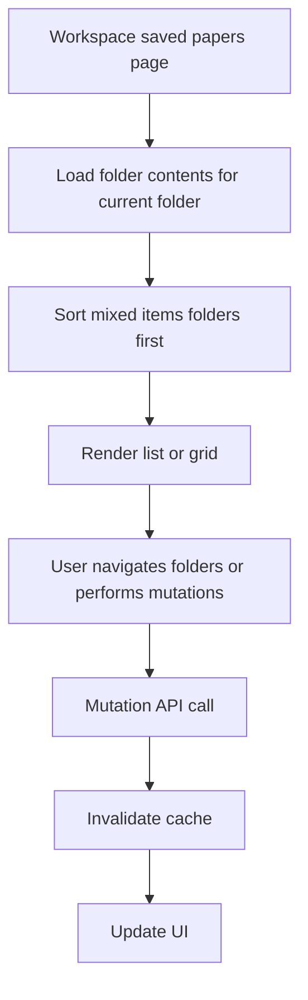

# Saved-Papers Module

## START HERE

This module covers saved-paper browsing, folder-scoped paper listing, sorting, view modes, and deletion actions.

IMPORTANT:

- Saved papers are rendered together with folders, but folder items must always appear first.
- Cache invalidation is required after folder/paper mutations.
- Delete actions must remain explicit and user-confirmed.

## 1. Business Logic

Saved Papers enables users to:

- View all saved papers for a workspace.
- Navigate nested folder organization.
- Sort and switch view mode.
- Delete saved papers from workspace catalog.

## 2. UI Components

| Component                    | Responsibility                             |
| ---------------------------- | ------------------------------------------ |
| `SavedPapersContent`         | main container and data orchestration      |
| `FolderHeader`               | current folder title and counts            |
| `FolderControls`             | sorting + list/grid controls               |
| `FolderList`                 | mixed rendering for folder and paper cards |
| `PaperItem`                  | saved paper card row/item rendering        |
| `EmptyState`, `FolderStates` | loading/error/empty displays               |

## 3. State Management

Key state in `SavedPapersContent`:

- `items`: mixed list of folders and papers.
- `currentFolderId`: active folder node.
- `breadcrumbs`: current path.
- `sortBy`: name/dateAdded/dateModified.
- `viewMode`: list/grid.
- mutation modal and submission states.

Cache strategy:

- `Map<folderKey, FolderItem[]>` in ref for quick navigation.
- invalidate current folder cache on create/update/delete operations.

## 4. Data Flow



## 5. API Integration

| Action                | Endpoint                                        |
| --------------------- | ----------------------------------------------- |
| Fetch folder contents | `GET /folders/workspace/:workspaceId?folderId=` |
| Fetch breadcrumb path | `GET /folders/:folderId/path`                   |
| Delete saved paper    | `DELETE /saved-papers/:paperId`                 |
| Folder CRUD (shared)  | folder endpoints from folders module            |

## 6. User Workflows

### 6.1 Browse Saved Papers

1. Open `/workspace/[id]/saved-papers`.
2. View root-level folders and papers.
3. Navigate through folders.
4. Use breadcrumbs to navigate up.

### 6.2 Sort and View

1. Choose sort option (name/date added/date modified).
2. Switch between list and grid view modes.
3. Items rerender in chosen representation.

### 6.3 Delete Paper

1. Trigger delete action on paper item.
2. Confirm in modal.
3. Paper deleted from backend.
4. Local list and cache update.

## 7. Common Issues and Solutions

| Issue                            | Cause                                       | Fix                                                   |
| -------------------------------- | ------------------------------------------- | ----------------------------------------------------- |
| Incorrect item order             | sort logic not preserving folder-first rule | enforce folder-first comparison before secondary sort |
| Deletion modal shows wrong title | stale selected paper state                  | reset selected object on modal close                  |
| Breadcrumb not reset at root     | missing root branch in fetchBreadcrumbs     | set empty breadcrumb when `currentFolderId` is null   |
| UI not refreshing after mutation | skipped cache invalidation                  | delete cache key then update list/refetch             |

## 8. Component Example

```tsx
const sortedItems = [...items].sort((a, b) => {
  if (a.itemType === "folder" && b.itemType === "paper") return -1;
  if (a.itemType === "paper" && b.itemType === "folder") return 1;
  return new Date(b.createdAt).getTime() - new Date(a.createdAt).getTime();
});
```

## 9. Integration Points

- Folders module provides hierarchy and CRUD contract.
- Papers module creates entries later displayed here.
- Paper-chat can consume saved-paper entities as context candidates.
- Notification context surfaces operation feedback.

## 10. Extension Guidelines

When extending saved-papers UX:

1. Preserve backward-compatible `FolderItem` union types.
2. Keep mutation UX optimistic only with clear rollback path.
3. Add filters and bulk actions with explicit confirmation patterns.
4. Document new controls in [COMPONENT_LIBRARY.md](../../COMPONENT_LIBRARY.md).
