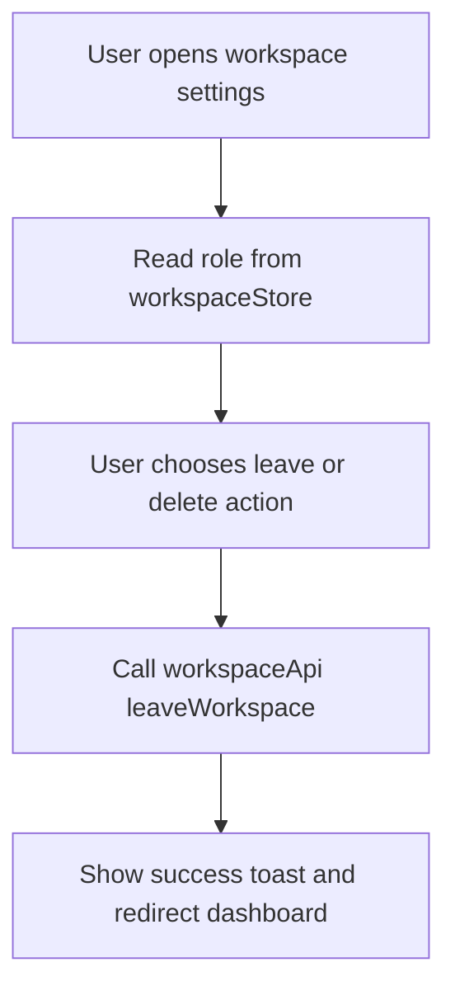
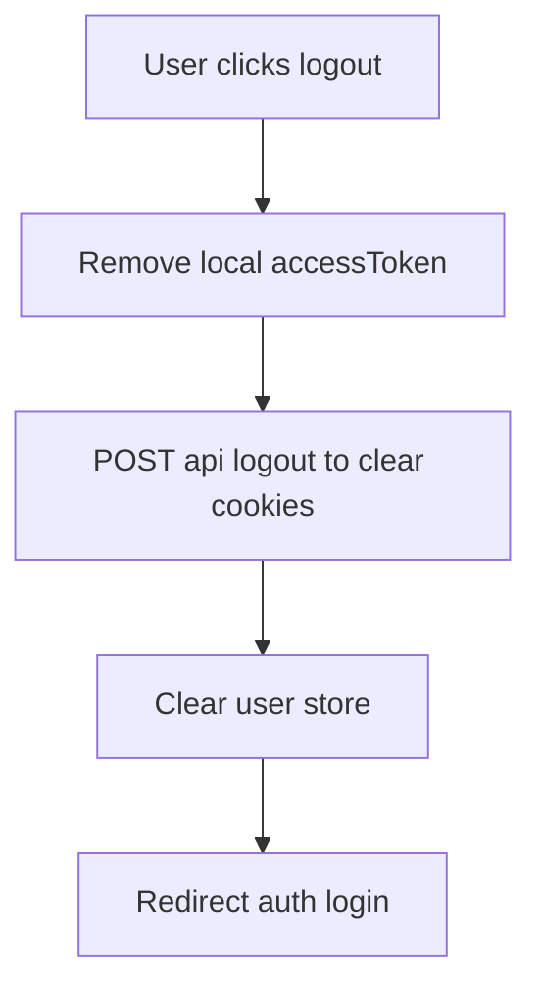
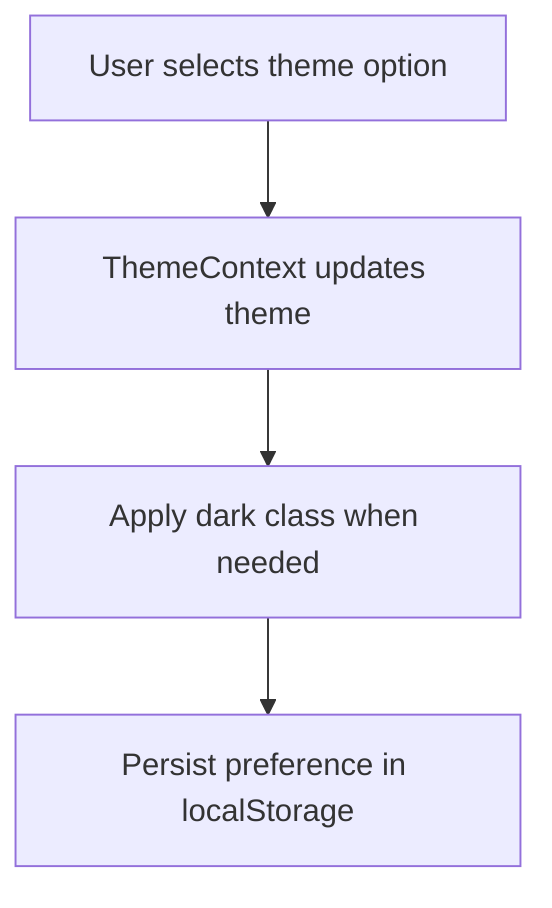

# User Profile Module

## START HERE

This module currently centers on account/session-related UI in workspace settings and top-level shell actions.

IMPORTANT:

- Logout must clear both client and server session artifacts.
- Workspace settings behavior is role-sensitive (owner vs member).
- Keep destructive actions explicit and confirmed.

## 1. Business Logic

User profile and account-facing behavior includes:

- Display user role context in workspace settings.
- Leave workspace (member) or delete workspace (owner semantic action).
- Logout from application shell.
- Theme preference controls (light/dark/system).

## 2. UI Components

| Component                          | Responsibility                                 |
| ---------------------------------- | ---------------------------------------------- |
| `workspace/[id]/settings/page.tsx` | role display, danger zone actions              |
| `Topbar`                           | theme controls, logout action                  |
| `Sidebar` profile footer           | basic profile identity and logout quick action |
| `Toast`                            | feedback for profile/account actions           |

## 3. State Management

### Global State

- `workspaceStore`: `currentWorkspaceId`, `isOwner`, `workspaceTitle`.
- `ThemeContext`: current theme and toggling.
- `userStore`: user identity and clear on logout.

### Local State

- settings page action states: confirmation toggle, loading state, toast state.

## 4. Data Flow



Logout flow:



Theme flow:



## 5. API Integration

| Action                 | Endpoint                                |
| ---------------------- | --------------------------------------- |
| Leave/delete workspace | `DELETE /workspaces/leave/:workspaceId` |
| Logout cookie cleanup  | `POST /api/logout`                      |

## 6. User Workflows

### 6.1 Leave Workspace (Member)

1. Open workspace settings.
2. In danger zone, choose leave action.
3. Confirm action.
4. API request completes.
5. User redirected to dashboard.

### 6.2 Delete Workspace (Owner)

1. Open workspace settings.
2. Danger zone describes destructive impact.
3. Confirm delete action.
4. API request executes owner-specific backend logic.
5. Redirect to dashboard.

### 6.3 Logout

1. Trigger logout from topbar/sidebar.
2. Frontend clears local token.
3. API route clears auth and CloudFront cookies.
4. User redirected to login.

### 6.4 Switch Theme

1. Open topbar theme menu.
2. Select light/dark/system.
3. ThemeContext updates class + local storage.

## 7. Common Issues and Solutions

| Issue                                         | Cause                                  | Fix                                                   |
| --------------------------------------------- | -------------------------------------- | ----------------------------------------------------- |
| User still appears authenticated after logout | cookie not cleared server-side         | confirm `/api/logout` executes and cookie names match |
| Role badge incorrect in settings              | workspaceStore stale                   | ensure workspace layout refreshes role on route enter |
| Destructive action accidental click           | missing confirmation gate              | preserve two-step confirmation UX                     |
| Theme reverts unexpectedly                    | localStorage not set or hydration race | ensure mounted logic and persistence path             |

## 8. Component Example

```tsx
const handleLeaveWorkspace = async () => {
  if (!currentWorkspaceId) return;
  setIsLeaving(true);
  try {
    await workspaceApi.leaveWorkspace(currentWorkspaceId);
    setToast({ message: "Workspace updated successfully", type: "success" });
    router.push("/dashboard");
  } catch {
    setToast({ message: "Failed to update workspace", type: "error" });
  } finally {
    setIsLeaving(false);
  }
};
```

## 9. Integration Points

- Workspace module provides role and workspace identity context.
- Authentication module provides user identity lifecycle.
- Shell components consume logout and theme actions.
- Development docs include auth/session debugging playbooks.

## 10. Extension Guidelines

Future profile/account additions should include:

1. Dedicated profile details page and API module methods.
2. Password and identity provider management screens.
3. Notification preferences and privacy settings.
4. Security events/audit trail UX.
5. Corresponding updates to [API_REFERENCE.md](../../API_REFERENCE.md).
