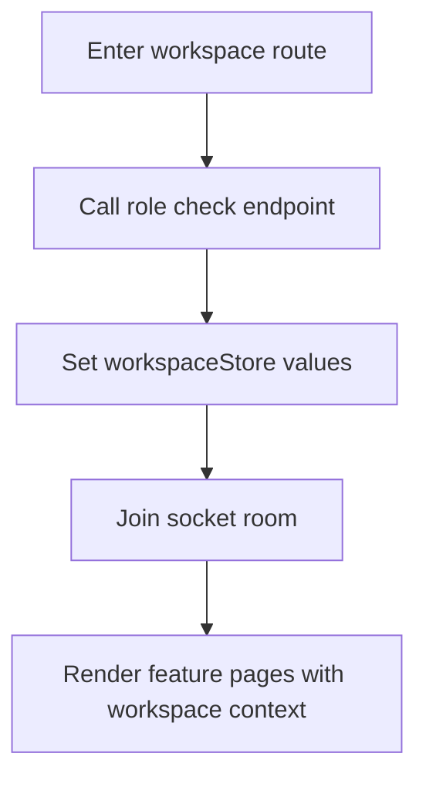
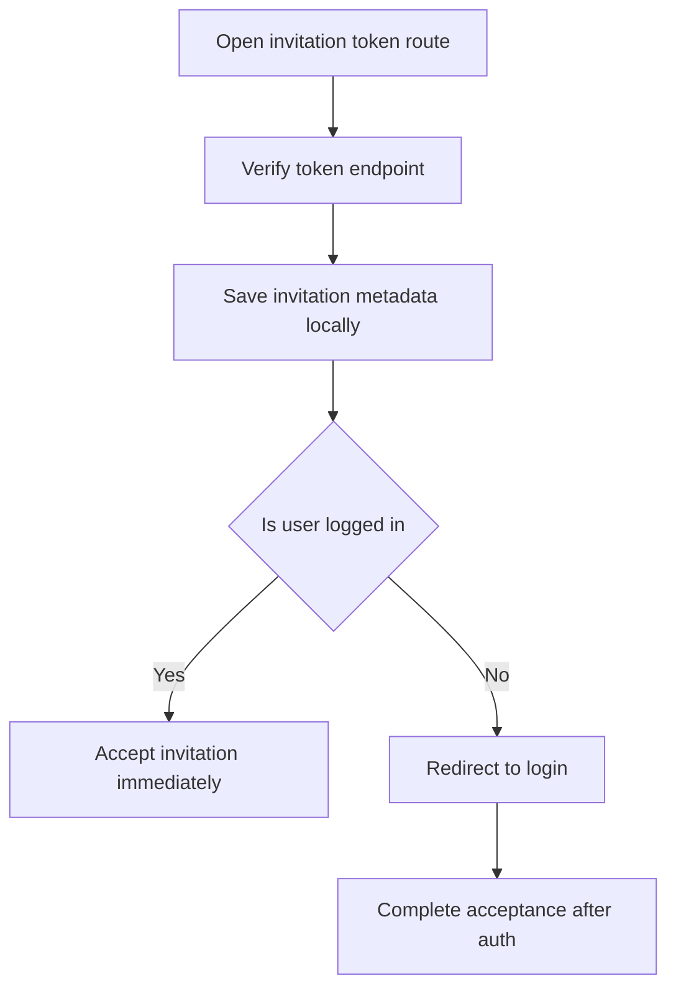

# Workspaces Module

## START HERE

This module defines workspace creation, switching, role detection, invitation workflows, and workspace-level settings behavior.

IMPORTANT:

- Workspace context (`workspaceStore`) is the single source for current workspace identity.
- Invitation flows must remain compatible with both authenticated and unauthenticated users.
- Role-based actions (owner/member) must preserve backend contract semantics.

## 1. Business Logic

Workspaces are the core collaboration unit. Users can:

- Create new workspace.
- View owner and member workspace lists.
- Switch active workspace.
- Send and accept invitations.
- Check role within workspace.
- Leave workspace or delete it (owner-triggered backend behavior).

## 2. UI Components

| Component                            | Responsibility                                     |
| ------------------------------------ | -------------------------------------------------- |
| `CreateWorkspaceModal`               | Workspace creation from global modal               |
| `WorkspaceSwitcher`                  | Owner/member tabbed list and navigation            |
| `InviteModal`                        | Invite collaborator by email with optional message |
| `workspace/[id]/layout.tsx`          | Sync workspace role/title and join socket room     |
| `accept-invitation/[token]/page.tsx` | Verify/accept invite and route appropriately       |
| `workspace/[id]/settings/page.tsx`   | Role display + leave/delete action                 |

## 3. State Management

### Global State

`workspaceStore` fields:

```ts
{
  currentWorkspaceId: string | null,
  isOwner: boolean | null,
  workspaceTitle: string | null,
  isSearching: boolean,
  setWorkspace(id, isOwner, title),
  clearWorkspace(),
  setIsSearching(flag)
}
```

### Local State

- Modal open/close flags.
- Invite form fields + loading status.
- Workspace switcher tab and loading state.
- Leave/delete confirmation visibility.

## 4. Data Flow

### Workspace Route Entry



### Invitation Acceptance



## 5. API Integration

| Action           | Endpoint                                  |
| ---------------- | ----------------------------------------- |
| Create workspace | `POST /workspaces/create`                 |
| List workspaces  | `GET /workspaces/all`                     |
| Owner workspaces | `GET /workspaces/owner`                   |
| Send invite      | `POST /workspaces/:workspaceId/invite`    |
| Verify invite    | `POST /workspaces/verify-invitation`      |
| Accept invite    | `POST /workspaces/accept-invitation`      |
| Role check       | `GET /workspaces/check-role/:workspaceId` |
| Leave/delete     | `DELETE /workspaces/leave/:workspaceId`   |

### Loading/Error States

- Workspace switcher displays spinner while fetching.
- Invite modal shows sending state and toast feedback.
- Settings page shows destructive action confirmation.
- Invitation route renders verifying/success/error states.

## 6. User Workflows

### 6.1 Create Workspace

1. Open create modal from sidebar.
2. Submit title.
3. Backend returns new workspace id.
4. App closes modal and routes to `/workspace/[id]`.

### 6.2 Invite Member

1. Open invite modal.
2. Enter email and optional message.
3. Submit invitation.
4. Show success toast.
5. Invitee receives tokenized invitation link.

### 6.3 Switch Workspace

1. Open workspace switcher.
2. Select owner/member tab.
3. Click workspace row.
4. Navigate to selected workspace route.
5. Workspace layout refreshes role/title state.

### 6.4 Leave or Delete Workspace

1. Open settings in target workspace.
2. Trigger danger zone action.
3. Confirm leave/delete action.
4. Backend handles role-specific operation.
5. App redirects to dashboard.

## 7. Common Issues and Solutions

| Issue                                           | Cause                              | Fix                                                                   |
| ----------------------------------------------- | ---------------------------------- | --------------------------------------------------------------------- |
| Sidebar links resolve wrong workspace           | workspaceId source mismatch        | Ensure `workspaceStore.currentWorkspaceId` is updated on layout mount |
| Accept invitation fails after successful verify | Missing auth token for accept call | Preserve invitation token and redirect through login                  |
| Owner/member tabs show incorrect data           | stale workspace list cache         | Refetch on modal open and clear local arrays when needed              |
| Settings action succeeds but UI stale           | workspace store not reset          | Ensure redirect and state cleanup happen after action                 |

## 8. Component Example

```tsx
useEffect(() => {
  const fetchWorkspaceDetails = async () => {
    const res = await workspaceApi.checkWorkspaceRole(workspaceId);
    const ws = res.data.data;
    setWorkspace(workspaceId, ws.isOwner, ws.title);
  };

  fetchWorkspaceDetails();
  return () => clearWorkspace();
}, [workspaceId]);
```

## 9. Integration Points

- Authentication: invitation flow continuation after login/signup.
- Chat: workspace layout triggers room join for real-time events.
- Sidebar navigation: dynamic route composition uses active workspace.
- User profile/settings: leave/delete action anchored in workspace context.

## 10. Extension Guidelines

When adding workspace features:

1. Add API method in `workspaceApi`.
2. Reuse workspaceStore for shared workspace identity.
3. Add role checks where actions are sensitive.
4. Update this module doc and [API_REFERENCE.md](../../API_REFERENCE.md).
